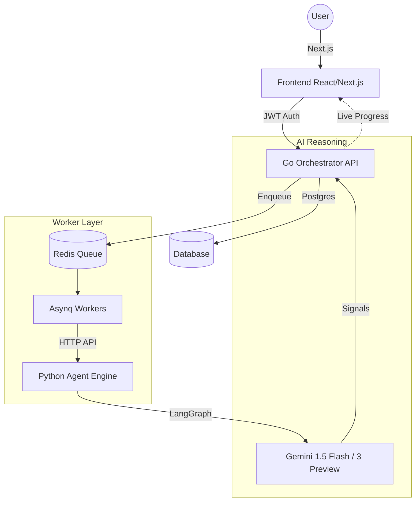

# AgenticSaaS 🚀
### Enterprise-Grade [Distributed AI Orchestration](https://github.com)

AgenticSaaS is a polyglot microservices platform designed for high-performance AI agent workflows. It leverages **Go** for high-concurrency orchestration, **Python** for sophisticated AI reasoning (LangGraph), and **Redis** for asynchronous task distribution.

---

## 🏗️ Architecture Overview

The system is built on a distributed microservices model to ensure scalability and fault tolerance.



---

## 🛠️ Tech Stack

| Layer | Technology | Purpose |
| :--- | :--- | :--- |
| **Frontend** | Next.js (TS), Tailwind CSS, Lucide | Premium UI/UX & Real-time polling |
| **Orchestration** | Go (Fiber), Gorm | High-speed API & JWT Security |
| **Task Queue** | Redis, Asynq | Asynchronous background processing |
| **AI Agent** | Python, LangGraph, LangChain | Multi-step reasoning & state management |
| **Model** | Google Gemini | Large Language Model (Flash/Pro) |
| **Auth** | Google OAuth, GitHub OAuth, JWT | Secure identity management |

---

## ⚡ Key Features

1. **Multi-Phase Reasoning**: Agents follow a strategic **Planning $\to$ Researching $\to$ Styling** flow.
2. **Real-Time Signaling**: Watch agents think in real-time with live content streaming to the dashboard.
3. **Dual-Oauth Auth**: Instant access via Google or GitHub for developer-friendly onboarding.
4. **Fault-Tolerant**: Independent microservices with retries and task persistence.
5. **SaaS Graphics**: Premium, responsive dashboard with glassmorphism and animated workflow tracking.

---

## 🚀 Getting Started

### 1. Prerequisites
- Docker & Docker-Compose
- Go 1.25+
- Python 3.10+
- Google Cloud API Key (Gemini)
- Google OAuth Client ID
- GitHub OAuth Client ID & Secret

### 2. Environment Setup
Create a `.env` in the `orchestrator/` and `agent-engine/` directories:

**Orchestrator (.env):**
```env
DB_HOST=localhost
DB_PORT=5433
REDIS_ADDR=127.0.0.1:6379
JWT_SECRET=your_secret
GOOGLE_CLIENT_ID=your_id
GITHUB_CLIENT_ID=your_id
GITHUB_CLIENT_SECRET=your_secret
```

**Agent Engine (.env):**
```env
GOOGLE_API_KEY=your_key
```

### 3. Run the Stack (Development)
```bash
# Start Infra (Redis/Postgres)
make run-infra

# Run Orchestrator
make run-orch

# Run Agent
make run-agent

# Run Frontend
make run-frontend
```

### 🚢 Deploy via Terminal (Production)
For a complete, containerized production deployment:

**On Windows (PowerShell):**
```powershell
# Build all production images
.\scripts\deploy.ps1 -Action build-prod

# Deploy the entire stack
.\scripts\deploy.ps1 -Action deploy-prod
```

**On Linux/CI-CD (Bash):**
```bash
# Build all production images
make build-prod

# Deploy the entire stack
make deploy-prod
```

### ☁️ Cloud Deployment (Azure)
This project is optimized for **Azure Container Apps (Serverless)**.
- **Infrastructure**: See [infra/terraform/azure.tf](./infra/terraform/azure.tf)
- **CI/CD**: See [.github/workflows/deploy-azure.yml](./.github/workflows/deploy-azure.yml)
- **Full Guide**: [docs/deployment.md](./docs/deployment.md)


---

## 📡 Live Signaling Flow
AgenticSaaS uses a bi-directional signaling pattern. While the `Asynq` worker handles the heavy lifting, the **Python Agent** sends HTTP "heartbeats" back to the **Go API** at every phase of its reasoning cycle. This allows the frontend to show **live "thinking" progress** even during long-running tasks.

---

## 📂 Project Structure

```text
├── apps/
│   ├── agent-engine/    # Python LangGraph engine (FastAPI/LangGraph)
│   ├── orchestrator/    # Go (Fiber) & Asynq Workers
│   └── frontend/        # Next.js 15+ Dashboard
├── configs/             # Shared configuration files
├── deployments/         # Docker, K8s, and CI/CD configurations
│   └── docker/          # Docker compose and service-specific Dockerfiles
├── docs/                # System documentation and architecture diagrams
├── infra/               # Infrastructure as Code (Terraform, etc.)
├── libs/                # Shared internal libraries and protos
├── scripts/             # Development and deployment scripts
├── tests/               # End-to-end and integration tests
├── Makefile             # Root task runner
└── docker-compose.yaml  # Infrastructure orchestration
```

